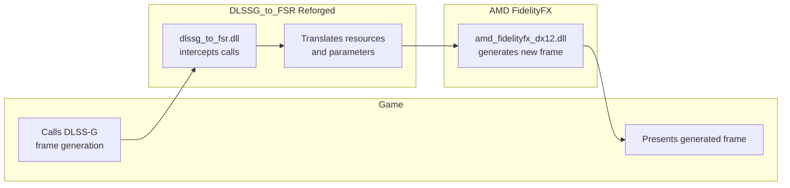

<div align="center">


# DLSSG_to_FSR Reforged

**Use AMD FidelityFX Frame Generation in games built for NVIDIA DLSS-G.**

<a href="https://github.com/RespectMathias/dlssg_to_fsr/releases/latest">
  
</a>
<a href="https://github.com/Nukem9/dlssg-to-fsr3/wiki/Game-Compatibility-List">
  
</a>
<a href="https://github.com/RespectMathias/dlssg_to_fsr/issues">
  
</a>


<br><br>

[Download](https://github.com/RespectMathias/dlssg_to_fsr/releases/latest) ·
[Compatibility](https://github.com/Nukem9/dlssg-to-fsr3/wiki/Game-Compatibility-List) ·
[Issues](https://github.com/RespectMathias/dlssg_to_fsr/issues) ·
[Original project](https://github.com/Nukem9/dlssg-to-fsr3)

</div>

## About

**DLSSG_to_FSR Reforged** is a drop-in replacement for games using [NVIDIA DLSS-G Frame Generation](https://nvidianews.nvidia.com/news/nvidia-introduces-dlss-3-with-breakthrough-ai-powered-frame-generation-for-up-to-4x-performance).

It intercepts DLSS-G frame-generation calls and redirects them to [AMD FidelityFX Frame Generation](https://github.com/GPUOpen-LibrariesAndSDKs/FidelityFX-SDK), allowing supported games to use AMD frame generation on:

- GeForce GTX 16 series
- GeForce RTX 20 series
- GeForce RTX 30 series

This project continues the work of [Nukem9/dlssg-to-fsr3](https://github.com/Nukem9/dlssg-to-fsr3) with newer FidelityFX support, expanded installation options, and continued compatibility work.

> [!NOTE]
> This project replaces **DLSS Frame Generation**, not DLSS Super Resolution. Continue using the game's normal upscaling option unless its compatibility instructions say otherwise.

## Important

> [!CAUTION]
> **Do not use this mod in online or multiplayer games.**
>
> Injected DLLs may trigger anti-cheat systems and could result in an account suspension or ban. Use this project at your own risk.

Compatibility varies between games, game updates, graphics drivers, and other installed mods.

Check the [game compatibility list](https://github.com/Nukem9/dlssg-to-fsr3/wiki/Game-Compatibility-List) before installing.

## Quick start

1. [Download the latest release](https://github.com/RespectMathias/dlssg_to_fsr/releases/latest).
2. Extract the complete archive.
3. Run the installer.
4. Select the installation mode recommended for the game.
5. Enable DLSS Frame Generation in the game settings.

Do not run the installer from inside the release archive.

## Download

Download the latest archive from [GitHub Releases](https://github.com/RespectMathias/dlssg_to_fsr/releases/latest).

The release contains one core DLL:

```text
dlssg_to_fsr.dll
```

The installer renames and deploys it according to the selected installation mode.

## Installation

### Windows

1. Extract the release archive.
2. Run `windows_install.bat`.
3. Select the installation mode matching the game or mod loader.
4. Select the game executable or plugin directory.
5. Start the game.
6. Enable DLSS Frame Generation in the game settings.

The installer:

- backs up conflicting files
- records installed files in an install manifest
- deploys the DLL under the required filename
- renames itself to `windows_uninstall.bat`

Run `windows_uninstall.bat` to remove the mod and restore previous files.

### Linux and Proton

1. Extract the release archive.
2. Open a terminal in the extracted directory.
3. Run:

```bash
bash linux_install.sh
```

4. Select the matching installation mode.
5. Select the game directory.

After installation, the script is renamed to:

```text
linux_uninstall.sh
```

Run it to remove the mod and restore backed-up files.

## Installation modes

| Mode         | Use                                                 |
| ------------ | --------------------------------------------------- |
| `version`    | Installs as `version.dll`                           |
| `winhttp`    | Installs as `winhttp.dll`                           |
| `dbghelp`    | Installs as `dbghelp.dll`                           |
| `nvngx`      | Installs as an NVIDIA NGX replacement               |
| `asi`        | Installs as an ASI plugin                           |
| `red4ext`    | Installs through RED4ext                            |
| `optiscaler` | Installs as an OptiScaler frame-generation provider |

Use the mode recommended by the game's compatibility instructions.

### OptiScaler mode

OptiScaler mode installs the provider as:

```text
dlssg_to_fsr3_amd_is_better.dll
```

This legacy filename is intentionally retained because OptiScaler currently loads the provider under that exact name.

The project, build target, configuration file, log file, and normal release DLL use the new `dlssg_to_fsr` name.

## Headless installation

### Windows

```bat
windows_install.bat -Mode optiscaler -TargetPath "C:\Games\Example" -Force
```

### Linux and Proton

```bash
bash linux_install.sh --mode=optiscaler --target="$PWD"
```

## Configuration

Copy the default configuration file into the game directory:

```text
resources/dlssg_to_fsr.ini
```

The configuration file contains logging, visualization, and developer options.

Logs are written to:

```text
dlssg_to_fsr.log
```

Supported configuration values may also be supplied through environment variables.

## How it works



1. The game calls NVIDIA DLSS-G frame-generation APIs.
2. `dlssg_to_fsr.dll` intercepts those calls.
3. Game resources and parameters are translated into the format expected by AMD FidelityFX Frame Generation.
4. `amd_fidelityfx_dx12.dll` generates the additional frame.
5. The generated frame is returned to the game for presentation.

The game behaves as though it is using DLSS-G while AMD FidelityFX performs the frame generation.

`amd_fidelityfx_dx12.dll` is loaded dynamically from the same directory as `dlssg_to_fsr.dll`.

This means newer compatible versions of FSR can be used without rebuilding `dlssg_to_fsr.dll`.

## Compatibility

Compatibility depends on:

| Area             | Examples                                       |
| ---------------- | ---------------------------------------------- |
| Game integration | DLSS-G and Streamline versions                 |
| Graphics API     | DirectX 12 or Vulkan                           |
| Resources        | Formats, dimensions, motion vectors, and depth |
| Installation     | Proxy DLL or plugin loading method             |
| Other software   | Overlays, injectors, and graphics mods         |
| Protection       | Anti-cheat and integrity checks                |
| System           | GPU driver and Windows or Proton version       |

Start with the [upstream game compatibility list](https://github.com/Nukem9/dlssg-to-fsr3/wiki/Game-Compatibility-List).

Reforged releases may behave differently as newer game integrations and FidelityFX versions are supported.

## Reporting problems

Before opening an issue:

1. Check the compatibility list.
2. Remove other graphics injectors when possible.
3. Confirm the selected installation mode.
4. Reproduce the issue with logging enabled.

Include:

- game name and version
- game store
- GPU model
- graphics driver version
- Windows or Proton version
- selected installation mode
- graphics API
- other installed graphics mods
- `dlssg_to_fsr.log`

Do not report problems caused by repacked or unofficial builds.

## Building

### Requirements

- Repository cloned with all submodules
- Visual Studio 18 Build Tools with Desktop development with C++
- CMake 3.26 or newer
- vcpkg

### Clone

```powershell
git clone --recursive https://github.com/RespectMathias/dlssg_to_fsr.git
cd dlssg_to_fsr
```

When the repository has already been cloned without submodules:

```powershell
git submodule update --init --recursive
```

### Build with Visual Studio

1. Open the repository root or `CMakeLists.txt` in Visual Studio.
2. Select a CMake preset, such as `Universal Release x64`.
3. Build the `dlssg_to_fsr` target.
4. Find the compiled files in `bin`.

### Build release archives

Open Command Prompt in the repository root and run:

```bat
scripts\build.bat
```

The script builds the release configurations and writes the resulting archives to `bin`.

## Testing

### Run verification

```bat
scripts\test.bat
scripts\test.bat Release
scripts\test.bat Debug NgxAbi
scripts\test.bat Release --skip-gpu
```

Requires Visual Studio 18 Build Tools and the FidelityFX API DLL at `external\FidelityFX-SDK\PrebuiltSignedDLL\amd_fidelityfx_dx12.dll`. The script auto-detects VS and sets up the environment.

### Visual testbed

```bat
scripts\dx12_visual_test.bat
scripts\vulkan_visual_test.bat
```

Alternates interpolated and real outputs. Press `F` to toggle frame generation. Requires test configuration build (`scripts\test.bat`).

### Vulkan layers

Disable implicit layers before manual Vulkan or testbed execution:

```bat
set VK_LOADER_LAYERS_DISABLE=~implicit~
```

### DX11

DX11 frame generation is intentionally unsupported. Exports remain for ABI compatibility but return `NVSDK_NGX_Result_FAIL_FeatureNotSupported` (`0xBAD00001`). DX12 and Vulkan are supported.

## Releases

Changes, fixes, and compatibility updates are documented on the [Releases page](https://github.com/RespectMathias/dlssg_to_fsr/releases).

The historical changelog for the original project remains available in [Nukem9/dlssg-to-fsr3](https://github.com/Nukem9/dlssg-to-fsr3).

## Credits

- [Nukem9/dlssg-to-fsr3](https://github.com/Nukem9/dlssg-to-fsr3), the original project
- [OptiScaler](https://github.com/optiscaler/OptiScaler), including adapted Vulkan-to-DirectX 12 interoperability logic
- [AMD FidelityFX SDK](https://github.com/GPUOpen-LibrariesAndSDKs/FidelityFX-SDK)
- Project contributors and compatibility testers

## License

This project is distributed under the GNU General Public License version 3.

- [DLSSG_to_FSR GPLv3](resources/licenses/dlssg_to_fsr_license.txt)
- [OptiScaler GPLv3](resources/licenses/optiscaler_license.txt)
- [Third-party licenses](resources/licenses/third_party_licenses.txt)
